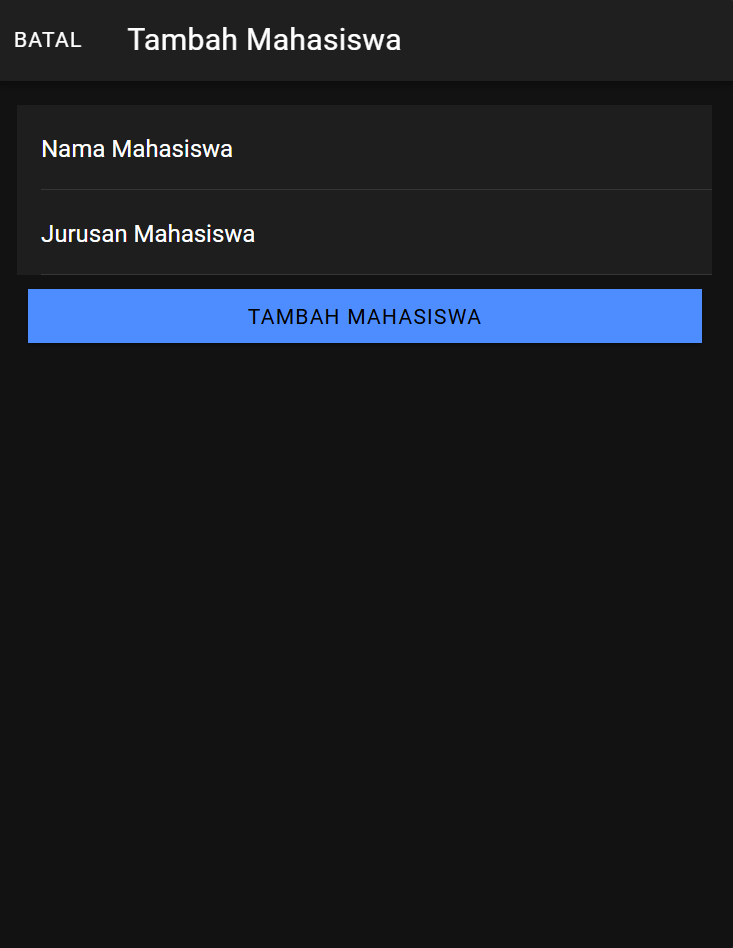
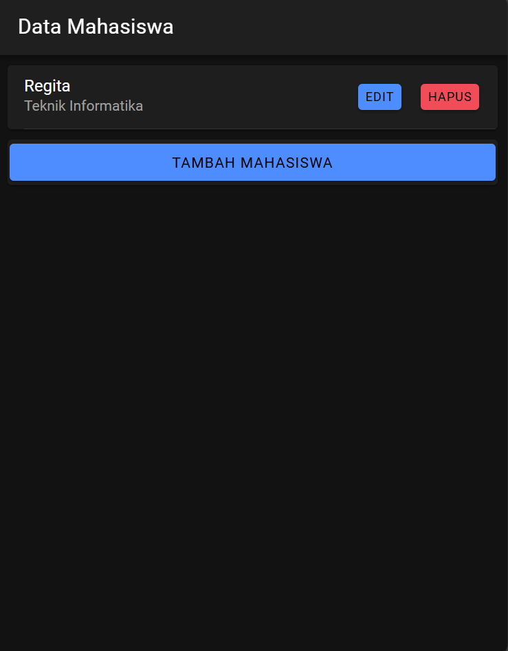
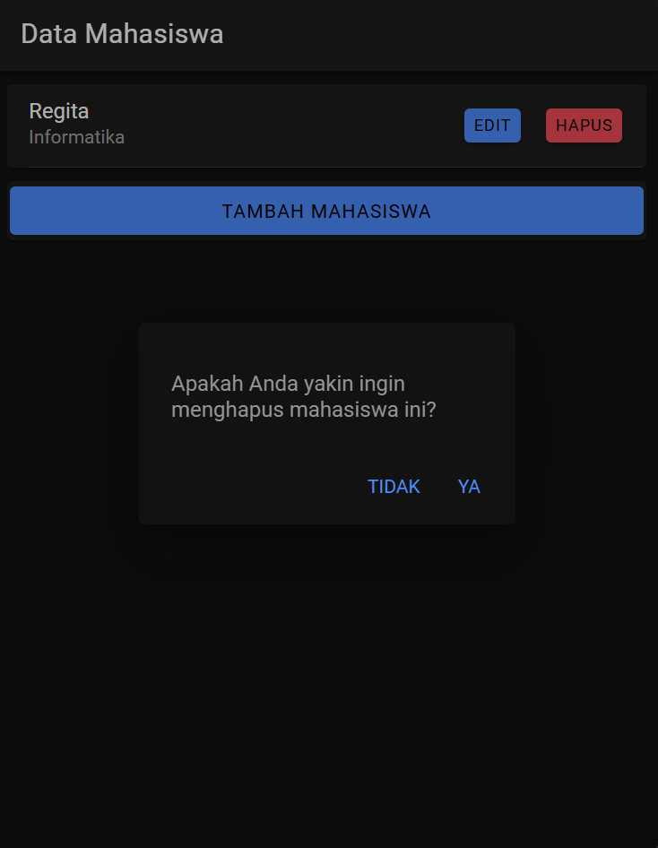

## Create
- Pada mahasiswa.page.html, terdapat tombol "Tambah Mahasiswa" yang membuka modal (openModalTambah) ketika ditekan. 
Modal ini berisi formulir untuk memasukkan nama dan jurusan mahasiswa.
- Data dari formulir ini disimpan ke dalam variabel nama dan jurusan yang terkait dengan ngModel di Angular.
- Ketika pengguna menekan tombol "Tambah Mahasiswa" pada modal, fungsi tambahMahasiswa() dipanggil.

- Fungsi tambahMahasiswa() memanggil metode tambah pada ApiService dan mengirimkan data ke endpoint PHP (tambah.php).
- Di tambah.php, data yang diterima dari input akan diambil, dan query SQL insert dijalankan untuk menyimpan data ke dalam database.
- Jika berhasil, data baru ditambahkan dan aplikasi mengembalikan respons JSON sebagai konfirmasi.

## Read
- Saat halaman mahasiswa.page.html dibuka, metode ngOnInit() pada MahasiswaPage memanggil fungsi getMahasiswa() untuk mengambil data mahasiswa dari backend.
- Fungsi getMahasiswa() menggunakan ApiService untuk memanggil endpoint PHP (tampil.php) yang mengembalikan seluruh data mahasiswa dalam bentuk array JSON.
- Data yang diterima kemudian disimpan dalam variabel dataMahasiswa yang ditampilkan dalam kartu (ion-card) untuk setiap mahasiswa.

- Endpoint tampil.php menjalankan query SQL SELECT untuk mengambil seluruh data dari tabel mahasiswa.
- Data yang diambil dari database kemudian di-encode ke dalam format JSON dan dikirim sebagai respons ke aplikasi.

## Update 
- Setiap kartu mahasiswa memiliki tombol "Edit" yang, ketika ditekan, memanggil fungsi openModalEdit(). Fungsi ini membuka modal edit dan memuat data mahasiswa yang dipilih ke dalam formulir.
- Fungsi ambilMahasiswa() di openModalEdit menggunakan ApiService untuk mengambil detail mahasiswa tertentu melalui endpoint lihat.php dengan parameter id.
- Setelah data dimuat dalam formulir, pengguna dapat mengedit nama dan jurusan, lalu menekan tombol "Edit Mahasiswa" yang memanggil fungsi editMahasiswa().

- Fungsi editMahasiswa() memanggil metode edit pada ApiService dan mengirimkan data baru ke endpoint edit.php.
- Di edit.php, query SQL UPDATE dijalankan untuk memperbarui data mahasiswa berdasarkan id yang diberikan.
- Respons JSON dikirim sebagai konfirmasi berhasil atau gagal dalam edit.

## Delete
- Setiap card mahasiswa memiliki tombol "hapus", yang ketika ditekan, memanggil fungsi confirmDelete(). Fungsi ini menampilkan dialog konfirmasi untuk memastikan apakah pengguna benar-benar ingin menghapus data tersebut.
- Jika pengguna memilih untuk melanjutkan, confirmDelete akan memanggil hapusMahasiswa() yang menggunakan ApiService untuk mengirim permintaan hapus ke backend (hapus.php) berdasarkan id mahasiswa.

- Endpoint hapus.php mengambil id mahasiswa yang akan dihapus, lalu menjalankan query SQL DELETE.
- Jika berhasil, JSON dikirim sebagai respons dengan status konfirmasi penghapusan.
- Implementasi API Service (api.service.ts)
ApiService berfungsi sebagai abstraksi untuk komunikasi antara frontend dan backend menggunakan metode HTTP (GET, POST, PUT, DELETE). Ini mendefinisikan berbagai method seperti tambah, edit, tampil, hapus, dan lihat yang masing-masing menghubungkan ke endpoint PHP yang sesuai

### Routing Angular (app-routing.module.ts)
Mengarahkan ke MahasiswaPage sebagai halaman utama ketika aplikasi dibuka

## Tampilan
### Home

### Form Tambah Mahasiswa

### Tambah Mahasiswa

### Tampil Data Mahasiswa

### Edit Mahasiswa

### Berhasil Mengubah Data

### Konfirmasi Hapus

